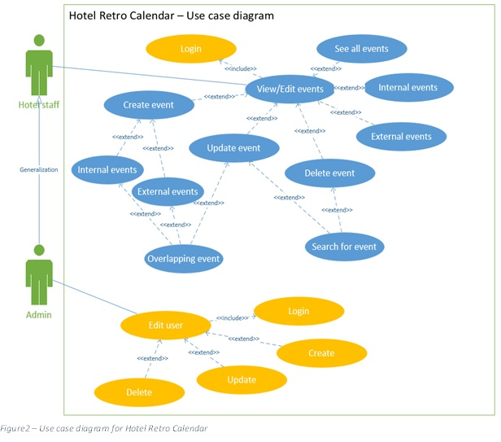
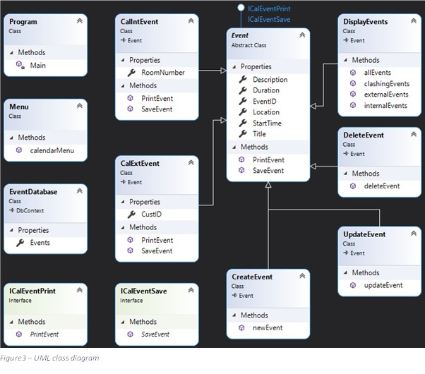
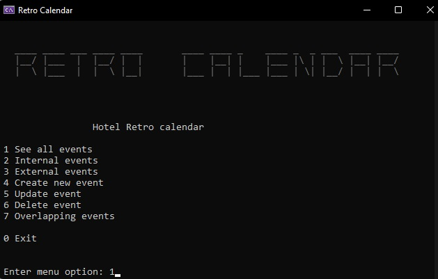

# C# Hotel booking calendar

## Description

The application was designed following the Object-Oriented programming concept.
This C# application is a simple hotel management system, meaning to enable hotel staff to manage various events (perform CRUD operations within the provided database). 

### Use-case diagram

*The blue use-cases below are currently functional, however the yellow use-cases seen below are not currently implemented, only pointing to future improvements. 

    

### UML class diagram

*The UML below displays the classes, including their components (properties and methods) and the relationships between them.

    

## Getting Started

1. Clone the repository by entering the following command in your IDE terminal:
	git clone https://github.com/andreibarstan/CICA.git

2. Once the repository is cloned, using Visual Studio Code, open the "CICA.csproj" file

3. Run the program. A console windows should open as below:

    

	

## Acknowledgments

* .NET documentation